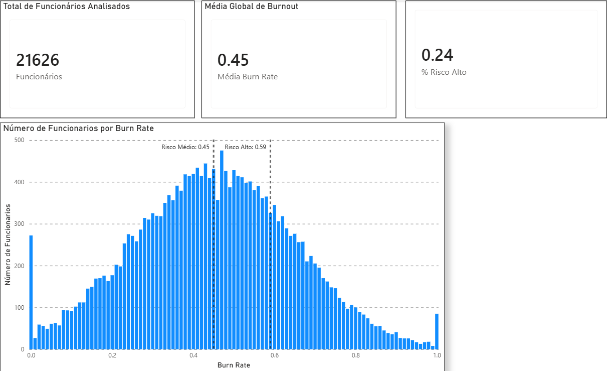
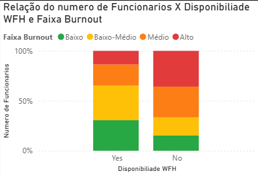
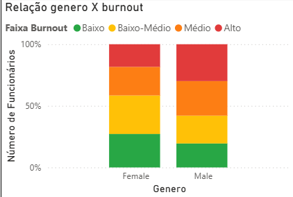
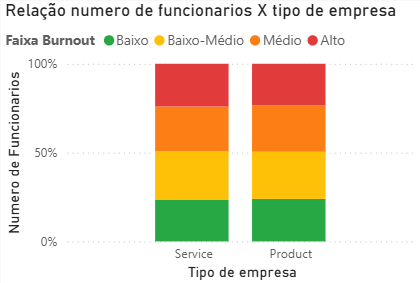
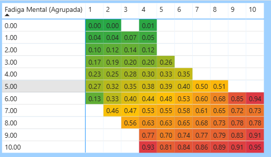
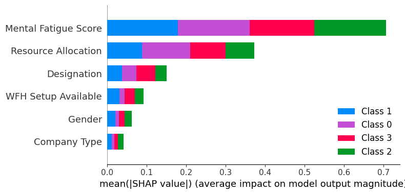
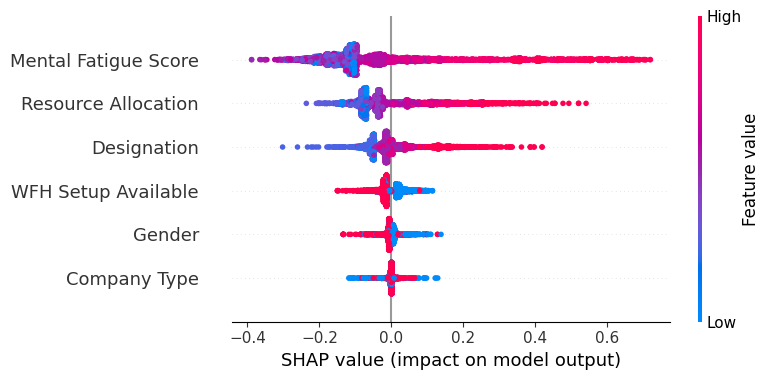

# Burnout Insight — Classificação de Risco de Esgotamento Profissional

Projeto de Data Science que combina análise exploratória, storytelling com dados e Machine Learning para classificar o nível de risco de burnout de colaboradores e apoiar decisões de gestão de pessoas.

Dataset: [Are Your Employees Burning Out?](https://www.kaggle.com/datasets/blurredmachine/are-your-employees-burning-out) (Kaggle)

---

## Resumo

Este projeto transforma um problema de regressão (burn rate) em uma tarefa de classificação de risco de burnout, permitindo identificar colaboradores em níveis:

- Baixo risco
- Baixo-Médio
- Médio
- Alto

O modelo Random Forest atingiu **73.3% de acurácia** e revelou que:

- Fadiga mental e carga de trabalho são os principais motivos de burnout
- Trabalho remoto atua como fator de proteção

## O Problema

Empresas geralmente só percebem o burnout quando ele já virou crise: queda de produtividade, aumento de turnover, afastamentos. O problema é que burnout não aparece de uma hora para outra, ele é a combinação acumulada de sobrecarga estrutural com exaustão psicológica, e identificar esse padrão cedo exige mais do que acompanhar quantas tarefas um funcionário tem.

O projeto foi estruturado em duas camadas: primeiro entender os dados e extrair insights do comportamento do burnout no dataset; depois construir um modelo capaz de classificar o nível de risco de cada colaborador, com interpretabilidade suficiente para que os resultados sejam acionáveis.

---

## Estrutura do Projeto

```
burnoutClassification/
├── dashboard/             # Arquivo Power BI (.pbix)
├── data/
│   ├── raw/
│   │   ├── train.csv
│   │   └── test.csv
│   └── processed/
│       └── train_cleaned.csv
├── model/
│   └── randomForest.py
├── prepare_data.py
└── README.md
```

---

## Como Executar

```bash
git clone https://github.com/rennancarneiro/burnoutClassification
cd burnoutClassification

python -m venv venv
source venv/bin/activate  # Windows: venv\Scripts\activate

pip install -r requirements.txt
```

---

## Camada 1 — Análise Exploratória

O objetivo foi entender o que os dados dizem sobre burnout: quem está em risco, o que contribui para isso e se existem combinações de fatores particularmente perigosas.

O dataset cobre **21.626 funcionários**. A média global de burn rate é **0.45**, e cerca de **24%** dos colaboradores se enquadram na faixa de risco crítico (burn rate > 0.59).


*Painel geral com os KPIs principais do dataset*

O histograma de distribuição do burn rate mostra uma curva aproximadamente normal centrada em 0.45, com concentração relevante nas faixas de risco médio e alto — o que reforça que burnout não é um fenômeno isolado em casos extremos, mas algo distribuído de forma ampla entre os colaboradores.


### Achado 1 — Trabalho remoto protege contra burnout

Funcionários sem acesso a WFH concentram proporções notavelmente maiores nas faixas de risco Médio e Crítico. O formato presencial emergiu como o principal fator organizacional de risco e o dado é suficientemente claro para aparecer com destaque no modelo preditivo depois.


*Comparação de distribuição de risco entre colaboradores com e sem acesso a trabalho remoto*

### Achado 2 — Gênero importa, mas de forma assimétrica

A proporção de colaboradores do gênero masculino nas faixas de risco mais severas é maior do que a feminina. Não é uma diferença categórica é uma tendência consistente que o modelo acaba capturando, ainda que com peso menor.


*Distribuição de risco por gênero — concentração maior nas faixas altas no sexo masculino*

### Achado 3 — Tipo de empresa: quase empate técnico

A distribuição de risco entre colaboradores de empresas de Produto versus Serviço é praticamente igual. Isso indica que burnout é uma questão cultural e sistêmica, não de setor e que políticas de prevenção precisam ser pensadas no nível da organização, não do modelo de negócio.


*Distribuição de risco por tipo de empresa — sem diferença expressiva entre os setores*

### Achado 4 — A combinação crítica: Alocação de Recursos × Fadiga Mental

Este foi o achado mais importante da fase exploratória. A matriz de correlação cruzada entre `Resource Allocation` e `Mental Fatigue Score` mostra que burnout não dispara quando um dos dois é alto, dispara quando os dois são altos ao mesmo tempo.

Quando Resource Allocation ultrapassa o nível 7 **e** Mental Fatigue Score está acima de 6, a taxa média de burnout entra em zona crítica, atingindo médias de até **0.95**. Monitorar volume de tarefas isoladamente não é suficiente: é preciso considerar o custo cognitivo dessas tarefas.


*Heatmap de burn rate médio por combinação de alocação de recursos e fadiga mental — zona crítica em vermelho escuro*

Esse padrão de interação entre as duas variáveis foi o que motivou a decisão de usar um modelo baseado em árvores na camada 2, já que Random Forest captura naturalmente esse tipo de relação não-linear sem necessidade de feature engineering manual.

---

## Camada 2 — Modelo Preditivo

### Pré-processamento

O dataset original tinha valores nulos em `Burn Rate`, `Resource Allocation` e `Mental Fatigue Score`. A estratégia foi remover os registros sem valor na variável alvo (já que imputar o que se quer prever introduziria viés) e preencher as demais com a mediana, que é mais robusta a outliers do que a média.

```python
df = df.dropna(subset=['Burn Rate'])
df['Resource Allocation'] = df['Resource Allocation'].fillna(df['Resource Allocation'].median())
df['Mental Fatigue Score'] = df['Mental Fatigue Score'].fillna(df['Mental Fatigue Score'].median())
```

As variáveis categóricas foram codificadas manualmente. A escolha por encoding manual foi feita para garantir controle explícito sobre o mapeamento das categorias e evitar inconsistências em ambiente de produção.

```python
mapeamento_gender  = {'Female': 1, 'Male': 0}
mapeamento_company = {'Service': 1, 'Product': 0}
mapeamento_WFH     = {'Yes': 1, 'No': 0}
```

### Reformulação do Problema

`Burn Rate` é originalmente uma variável contínua entre 0 e 1 — um problema de regressão. A decisão foi transformá-lo em **classificação multiclasse**, discretizando em quatro faixas de risco.

A motivação não foi técnica, mas sim de negócio: o objetivo não era predizer se tem ou não. Mas sim separar por zonas e classificar de acordo com o resultados para auxiliar no gerenciamento e controle da equipe.

```python
bins = [0.0, 0.31, 0.45, 0.59, 1.0]
labels = [0, 1, 2, 3]

df['Burn Rate'] = pd.cut(df['Burn Rate'], bins=bins, labels=labels, include_lowest=True)
```

| Classe | Faixa | Descrição |
|--------|-------|-----------|
| 0 | 0.00 – 0.31 | Baixo risco |
| 1 | 0.31 – 0.45 | Risco moderado |
| 2 | 0.45 – 0.59 | Alto risco |
| 3 | 0.59 – 1.00 | Risco crítico |

Os limiares foram definidos com base nos próprios dados: 0.45 é a média global (ponto de inflexão natural) e 0.59 é o limiar identificado no dashboard como entrada na zona de alto risco.

### Modelo

```python
RandomForestClassifier(random_state=42, max_depth=15, n_estimators=300)
```

A escolha do Random Forest foi motivada por três razões: sem necessidade de normalização, controle de overfitting via `max_depth`, e compatibilidade nativa com SHAP para interpretabilidade.

Divisão dos dados: **80% treino / 20% teste**

**Acurácia: 73.3%**

### Avaliação do Modelo

Além da acurácia, o problema exige métricas mais robustas devido ao desbalanceamento entre classes.

Métricas recomendadas:
- F1-score por classe
- Matriz de confusão

> Observação: modelos de classificação de risco devem priorizar recall nas classes mais críticas (alto e crítico), já que falsos negativos têm maior custo.

### Interpretabilidade — SHAP

Acurácia de 73.3% em classificação multiclasse com 4 classes é um resultado razoável, mas o número sozinho não diz muito. O SHAP foi usado para abrir o modelo e entender o que ele aprendeu e para verificar se o que ele aprendeu faz sentido com o que a análise exploratória encontrou.

O summary plot de importância média por feature confirmou a hierarquia esperada:

1. **Mental Fatigue Score** — fator mais determinante, com impacto alto em todas as classes
2. **Resource Allocation** — segundo mais relevante, especialmente para risco crítico
3. **Designation** — cargo/senioridade tem peso moderado
4. **WFH Setup Available** — confirma o achado exploratório: presencial aumenta risco
5. **Gender** — impacto menor, mas consistente
6. **Company Type** — menor influência no modelo

O beeswarm para a Classe 3 (Risco Crítico) deixa claro que valores altos de fadiga mental e alocação de recursos puxam o modelo fortemente para classificar um colaborador como risco crítico o mesmo padrão de interação identificado na matriz de correlação cruzada da fase exploratória. Isso é uma boa sinal: o modelo aprendeu algo real, não ruído.



*Importância global das variáveis — domínio absoluto da Fadiga Mental e Alocação de Recursos na determinação do nível de risco.*



*Impacto direcional dos fatores — a alta fadiga acelera ativamente o colapso, enquanto o home office atua como escudo protetor.*

---

## Tecnologias

- Python, Pandas, scikit-learn
- SHAP
- Power BI

---

## Melhorias Futuras

- Avaliar com F1-score por classe e matriz de confusão.
- Testar XGBoost como alternativas ao Random Forest
- Deploy via API (FastAPI) ou interface Streamlit
- Pipeline automatizado de dados com retreinamento periódico

---

## Autor

Rennan Carneiro — [github.com/RennanCarneiro](https://github.com/RennanCarneiro)
